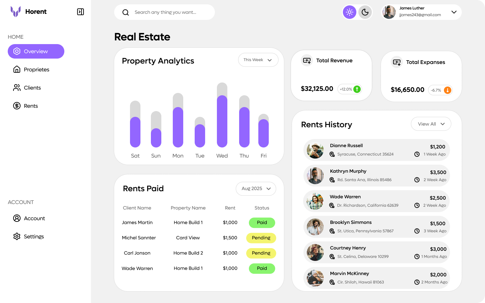

# Horent
<center>
  
</center>

Horent is a real estate renting dashboard designed to simplify property management and rental insights. Whether you're a landlord, property manager, or real estate agency, Horent provides an intuitive interface to monitor properties, tenants, leases, and payments in one centralized platform.

## ✨ Key Features

- Property Management – Add, edit, and track multiple rental properties.
- Tenant Overview – Manage tenant information, lease agreements, and occupancy status.
- Rental Analytics – Visualize revenue trends, vacancy rates, and upcoming lease expirations.
- Dashboard Insights – Get a quick snapshot of total properties, income, and active rentals.
- Search & Filter – Easily find properties or tenants with powerful filtering tools.
- Responsive Design – Optimized for desktop and mobile use.

# 🚀 Tech Stack
- Frontend: (React, React Router, Tailwind CSS)
- Backend: (Soon...)
- Database: (Soon...)
- Visualization: (Soon...)

# 🔁 Run The Project
Get the project up and running on your local machine with these simple steps:

### 1️⃣ Clone the Repository
```bash
git clone https://github.com/m0hkx/Horent.git
cd Horent
```

### 2️⃣ Install Dependencies
Make sure Node.js (v16 or higher) is installed, then run:
```bash
npm install
```

### 3️⃣ Start the Development Server
```bash
npm run dev
```
Your app will now be running at:
👉 http://localhost:5173


### 4️⃣ Build for Production
To create an optimized production build:

```bash
npm run build
```

### 5️⃣ Preview the Production Build
To preview what the production build looks like locally:

```bash
npm run preview
```
